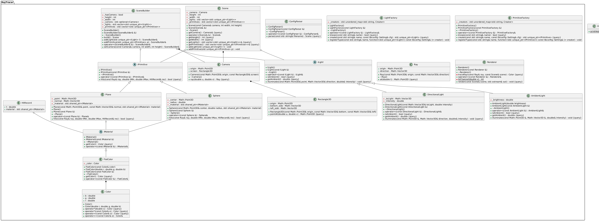

# 🚀 Raytracer

## 📝 Description

Raytracer est un moteur de rendu qui génère des images réalistes à partir d’une scène décrite dans un fichier de configuration.  
Il utilise la technique du **ray tracing** pour simuler le comportement de la lumière et produire une image finale.

---

## ⚙️ Compilation

### C++
- Makefile (`make`, `make re`, `make clean`, `make fclean`)

---

## ▶️ Utilisation

```bash
./raytracer <SCENE_FILE>
```

---

## Test

```bash
make test
```

## UML



## 👨‍💻 Auteurs

raphael.dumon@epitech.eu
clement.fabre@epitech.eu
matheo.emma@epitech.eu
seedjye.malbrouck@epitech.eu